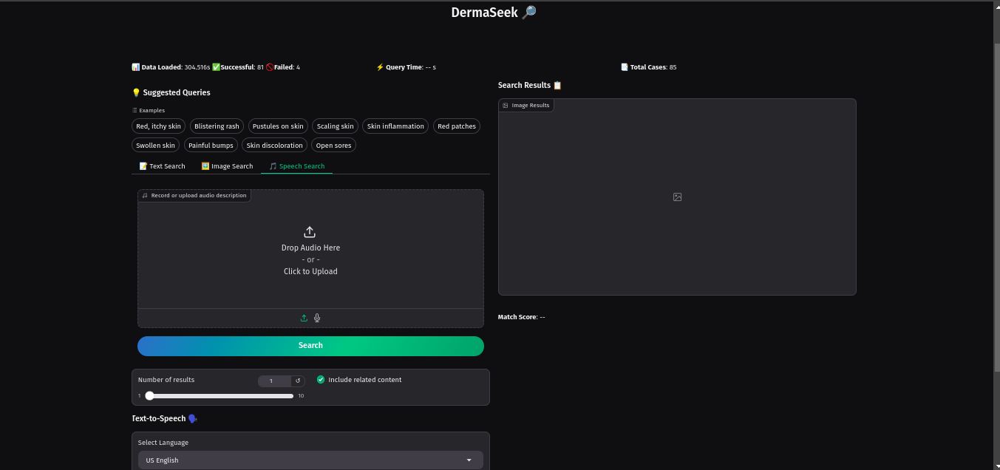

# DermaSeek 🔎

## Overview
DermaSeek is an AI-powered dermatology case search engine that enables medical students, researchers, and educators to explore dermatological cases through text, image, and speech queries. The system utilizes advanced embedding techniques and multimodal search capabilities to find relevant cases from a curated database.

## Features
- **Multimodal Search**:
  - Text-based search for symptoms and conditions
  - Image-based search using medical photographs
  - Speech-to-text search capabilities
- **AI-Powered Analysis**:
  - Case summarization using LLaMA 3.2
  - Semantic similarity matching
  - CLIP-based image understanding
- **Text-to-Speech**:
  - Multi-language support (US English, UK English, Indian English, Arabic, French)
  - High-quality speech synthesis
- **Interactive Interface**:
  - Suggested query recommendations
  - Adjustable number of results
  - Related content linking
  - Performance metrics display

## Getting Started

### Prerequisites
- Python 3.8+
- pip package manager
- Git

### Installation

1. Clone the repository:
```bash
git clone https://github.com/GeamXD/DermaSeek.git
cd DermaSeek
```

2. Install dependencies:
```bash
pip install -r requirements.txt
```

3. Install system packages:
```bash
sudo apt-get update
sudo apt-get install $(cat packages.txt)
```

### Setting up Google Cloud Text-to-Speech

1. Create a Google Cloud Project:
   - Go to [Google Cloud Console](https://console.cloud.google.com)
   - Create a new project or select an existing one
   - Enable the Cloud Text-to-Speech API

2. Create a Service Account:
   - Navigate to IAM & Admin > Service Accounts
   - Click "Create Service Account"
   - Grant "Cloud Text-to-Speech API User" role
   - Create and download the JSON key file

3. Configure Environment Variables:
   Create a `.env` file in the project root:
```env
GCP_TYPE="service_account"
GCP_PROJECT_ID="your-project-id"
GCP_PRIVATE_KEY_ID="your-private-key-id"
GCP_PRIVATE_KEY="your-private-key"
GCP_CLIENT_EMAIL="your-client-email"
GCP_CLIENT_ID="your-client-id"
GCP_AUTH_URI="https://accounts.google.com/o/oauth2/auth"
GCP_TOKEN_URI="https://oauth2.googleapis.com/token"
GCP_AUTH_PROVIDER_CERT_URL="https://www.googleapis.com/oauth2/v1/certs"
GCP_CLIENT_CERT_URL="your-client-cert-url"
```

### Setting up Together AI

1. Sign up at [Together AI](https://api.together.xyz/)
2. Get your API key from the dashboard
3. Add to your `.env` file:
```env
TOGETHER_API_KEY="your-api-key"
```

## Usage

1. Get Data(optional):
```bash
python data_collection.py
```

2. Start the application:
```bash
python app.py
```
3. Open your browser and navigate to `http://localhost:7860`

4. Use the interface to:
   - Search using text descriptions
   - Upload images for visual search
   - Record voice descriptions
   - Generate speech from case summaries

## Directory Structure
```
.
├── app.py                 # Main application file
├── data/                  # Data storage
│   └── cases_data.json   # Case database
├── data_collection.py     # Data collection utilities
├── img/                   # Image storage
├── output/               # Generated files
└── requirements.txt      # Python dependencies
```

## Demo
- Video Demo: [Watch on Loom](https://youtu.be/demo-link)
- Live Demo: [Try DermaSeek](https://huggingface.co/spaces/geamxd/DermaSeek)

## APP OVERVIEW
*Figure 1: App overview Interface*


*Figure 2: Querying App Interface*


*Figure 3: Showing Audio recording Interface*


*Figure 4: Showing Image Search Interface*


*Figure 5: Showing Text search Interface*


*Figure 6: Showing Aduio Upload Search Interface*


*Figure 7: Showing Text to Speech Interface*


## Real-World Use Cases for DermaSeek

1. **Medical Education**  
   - Interactive case-based learning for students.  
   - Links symptoms to diagnoses for better knowledge retention.  

2. **Clinical Research**  
   - Identify patterns and correlations in dermatology cases.  
   - Access curated databases for research and hypothesis testing.  

3. **Healthcare Professionals**  
   - Quick reference for patient condition comparisons.  
   - AI-powered second opinions through similarity matching.  

4. **Dermatology Workshops**  
   - Demonstrate diagnostics and symptom analysis interactively.  
   - Real-time searches for audience education.  

5. **Public Health**  
   - Educates the public with simple summaries and voice navigation.  
   - Multilanguage support enhances accessibility.  

6. **Medical Publishing**  
   - Generate educational content for blogs, courses, and publications.  
   - Include verified dermatology case examples.  

7. **AI and Tech Development**  
   - Benchmark and refine AI models for healthcare.  
   - Test voice, image, and text integration in medical tools.  

8. **Patient Education**  
   - Help patients learn about conditions with healthcare guidance.  

## Future Improvements
- [ ] Advanced filtering options
- [ ] User authentication system
- [ ] Case bookmarking
- [ ] Batch processing
- [ ] Integration with medical databases

## Acknowledgments
- DermNet NZ for the dermatology cases database
- Together AI for LLM capabilities
- Google Cloud for Text-to-Speech services
- Open source community for various tools and libraries

## Educational Purpose Disclaimer
DermaSeek is developed strictly for educational and research purposes. It is not intended for medical diagnosis or treatment decisions. Always consult qualified healthcare professionals for medical advice.

## Disclaimer
This software is not intended for medical diagnosis. All medical decisions should be made by qualified healthcare professionals.
